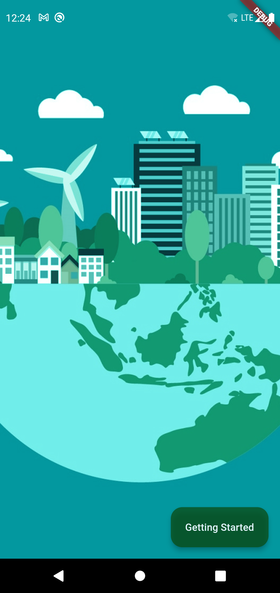
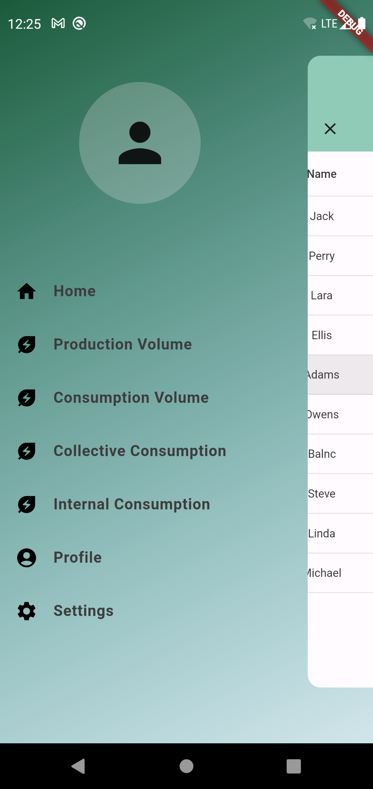
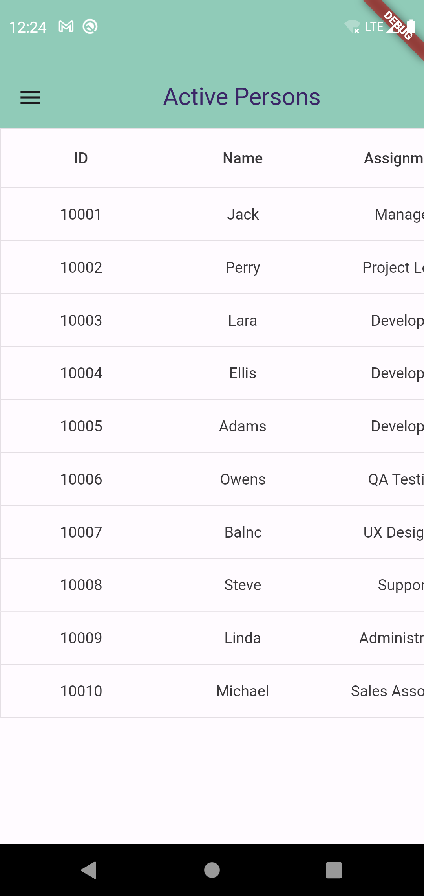
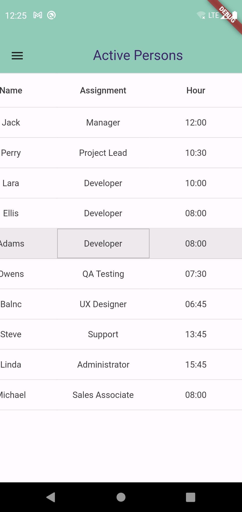
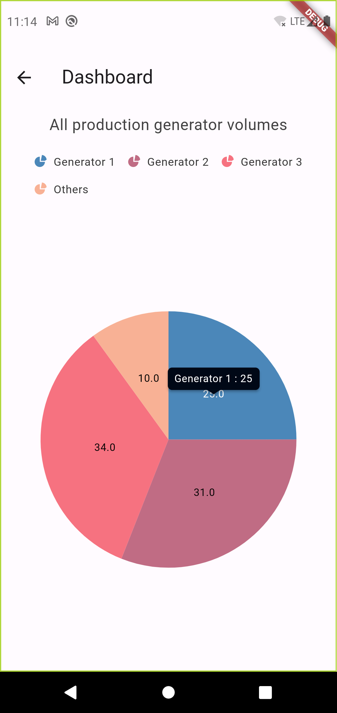
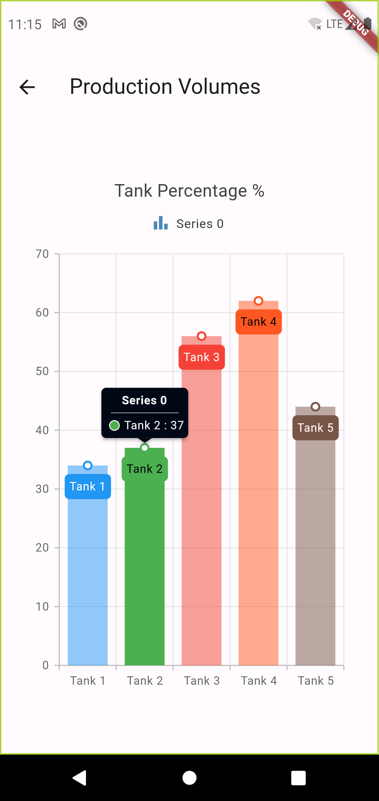

# energypocket

Its a Flutter mobile app project. Not finished yet!

## Getting Started

This project is a energy producing and comsuming tracking application for the companies.

## Usage

- Its will be add...

## ScreenShots (not finished!)

1- Splash Screen

    

2- Menu

    

3- Home Screens

    

    

4- Dashboard Screen

    

5- Production (Tanks) Volume Screen

    

